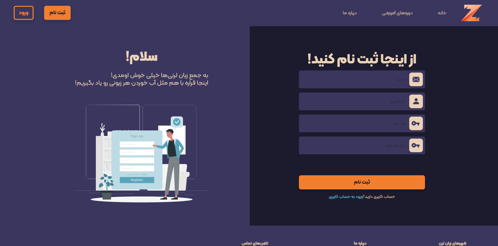
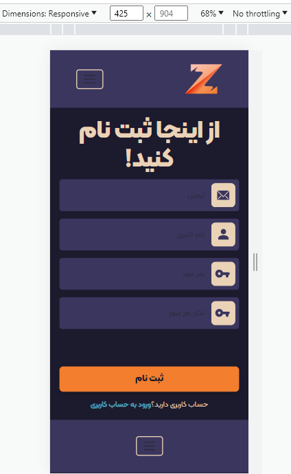
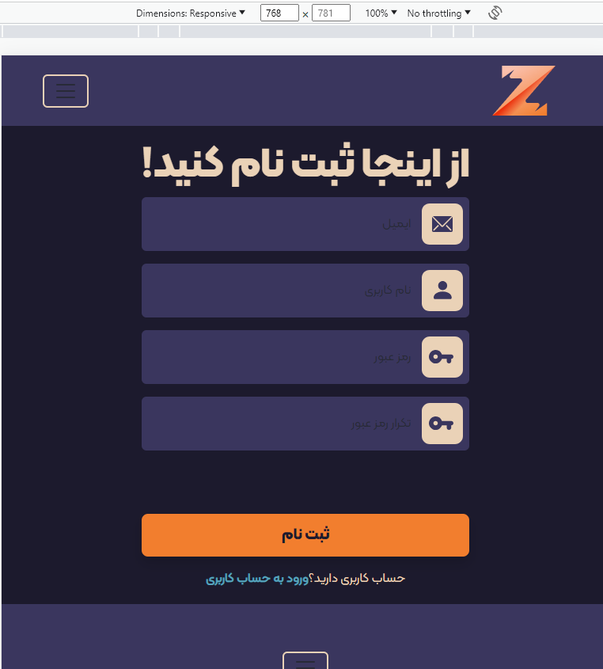

  <h1>
     Zaban Learn
  </h1> 

# Language-Institute-Website-React
This is a front-end project for a language institute built with **TypeScript, Bootstrap CSS, Vite, React.js, Scss, and Axios**. 

## ✨Features
- Full error checking (password length checking, duplicated username, duplicated email, ...).
- Full responsive (in three sizes: desktop, tablet, and phone)
- ...

## Responsive :")

   
   

